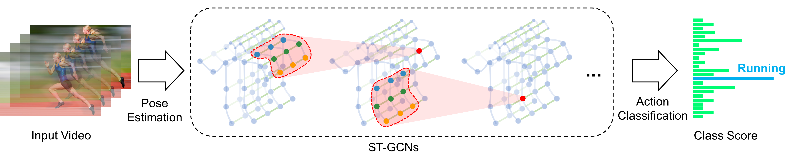

# Skeleton compensation and correction

## Our demo for skeleton compensation and correction based on action recognition:
<p align="center">
    
</p>

<p align="center">
    
</p>

## Our demo for nursing care posture REBA assessment :
<p align="center">
    
</p>

<p align="center">
    
</p>


The  above results is from nursing care task data.

Utilizing the action characteristics extracted from the Spatial-Temporal Graph 
Convolutional Network (ST-GCN), in conjunction with the kinematic chain analysis, 
a comprehensive evaluation is performed to determine both the structural integrity 
and the likelihood of erroneous identification within the skeletal framework. 
Subsequently, a compensatory mechanism is employed to rectify any discrepancies 
and refine the overall skeletal representation.

## Spatial Temporal Graph Convolutional Networks (ST-GCN)
A graph convolutional network for skeleton based action recognition.

<div align="center">
    
</div>


**Spatial Temporal Graph Convolutional Networks for Skeleton-Based Action Recognition** Sijie Yan, Yuanjun Xiong and Dahua Lin, AAAI 2018.


## Visulization of ST-GCN in Action
Demo for skeleton based action recognition:
<p align="center">
    
</p>


## Prerequisites
Codebase is based on **Python3** (>=3.5). There are a few dependencies to run the code. The major libraries we depend are
- [PyTorch](http://pytorch.org/) (Release version 0.4.0)
- [Openpose@92cdcad](https://github.com/yysijie/openpose) (Optional: for demo only)
- FFmpeg (Optional: for demo only), which can be installed by `sudo apt-get install ffmpeg`
- Other Python libraries can be installed by `pip install -r requirements.txt`

### Installation
```
cd torchlight; python setup.py install; cd ..
```

### Get pretrained models
Pretrained model weithts of **ST-GCN** was provided. The model weights can be downloaded by running the script
```
bash tools/get_models.sh
```
<!-- The downloaded models will be stored under ```./models```. -->


## Demo
To visualize how ST-GCN exploit local correlation and local pattern, we compute the feature vector magnitude of each node in the final spatial temporal graph, and overlay them on the original video. **Openpose** should be ready for extracting human skeletons from videos. The skeleton based action recognition results is also shwon thereon.

Run the demo by this command:
```
python main.py demo --openpose <path to openpose build directory> [--video <path to your video> --device <gpu0> <gpu1>]
```
A video as above will be generated and saved under ```data/demo_result/```.

## Data Preparation

We experimented on two skeleton-based action recognition datasts: **Kinetics-skeleton** and **NTU RGB+D**.

### Kinetics-skeleton
[Kinetics](https://deepmind.com/research/open-source/open-source-datasets/kinetics/) is a video-based dataset for action recognition which only provide raw video clips without skeleton data. Kinetics dataset include To obatin the joint locations, we first resized all videos to the resolution of 340x256 and converted the frame rate to 30 fps.  Then, we extracted skeletons from each frame in Kinetics by [Openpose](https://github.com/CMU-Perceptual-Computing-Lab/openpose). The extracted skeleton data we called **Kinetics-skeleton**(7.5GB) can be directly downloaded from [GoogleDrive](https://drive.google.com/open?id=1SPQ6FmFsjGg3f59uCWfdUWI-5HJM_YhZ) or [BaiduYun](https://pan.baidu.com/s/1dwKG2TLvG-R1qeIiE4MjeA#list/path=%2FShare%2FAAAI18%2Fkinetics-skeleton&parentPath=%2FShare).

After uncompressing, rebuild the database by this command:
```
python tools/kinetics_gendata.py --data_path <path to kinetics-skeleton>
```

### NTU RGB+D
NTU RGB+D can be downloaded from [their website](http://rose1.ntu.edu.sg/datasets/actionrecognition.asp).
Only the **3D skeletons**(5.8GB) modality is required in our experiments. After that, this command should be used to build the database for training or evaluation:
```
python tools/ntu_gendata.py --data_path <path to nturgbd+d_skeletons>
```
where the ```<path to nturgbd+d_skeletons>``` points to the 3D skeletons modality of NTU RGB+D dataset you download.

## Testing Pretrained Models

<!-- ### Evaluation
Once datasets ready, we can start the evaluation. -->

To evaluate ST-GCN model pretrained on **Kinetcis-skeleton**, run
```
python main.py recognition -c config/st_gcn/kinetics-skeleton/test.yaml
```
For **cross-view** evaluation in **NTU RGB+D**, run
```
python main.py recognition -c config/st_gcn/ntu-xview/test.yaml
```
For **cross-subject** evaluation in **NTU RGB+D**, run
```
python main.py recognition -c config/st_gcn/ntu-xsub/test.yaml
``` 

<!-- Similary, the configuration file for testing baseline models can be found under the ```./config/baseline```. -->

To speed up evaluation by multi-gpu inference or modify batch size for reducing the memory cost, set ```--test_batch_size``` and ```--device``` like:
```
python main.py recognition -c <config file> --test_batch_size <batch size> --device <gpu0> <gpu1> ...
```


## Training
To train a new ST-GCN model, run

```
python main.py recognition -c config/st_gcn/<dataset>/train.yaml [--work_dir <work folder>]
```
where the ```<dataset>``` must be ```ntu-xsub```, ```ntu-xview``` or ```kinetics-skeleton```, depending on the dataset you want to use.
The training results, including **model weights**, configurations and logging files, will be saved under the ```./work_dir``` by default or ```<work folder>``` if you appoint it.

You can modify the training parameters such as ```work_dir```, ```batch_size```, ```step```, ```base_lr``` and ```device``` in the command line or configuration files. The order of priority is:  command line > config file > default parameter. For more information, use ```main.py -h```.

Finally, custom model evaluation can be achieved by this command as we mentioned above:
```
python main.py recognition -c config/st_gcn/<dataset>/test.yaml --weights <path to model weights>
```

```
